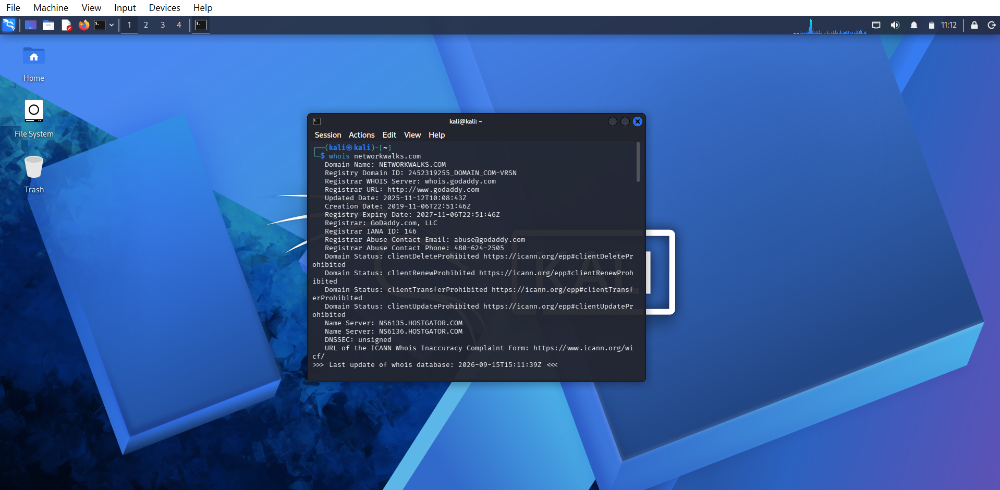
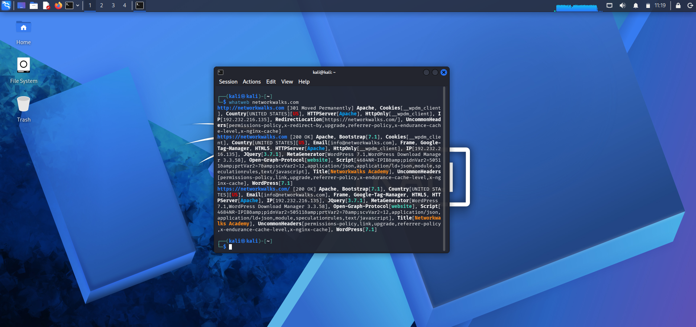
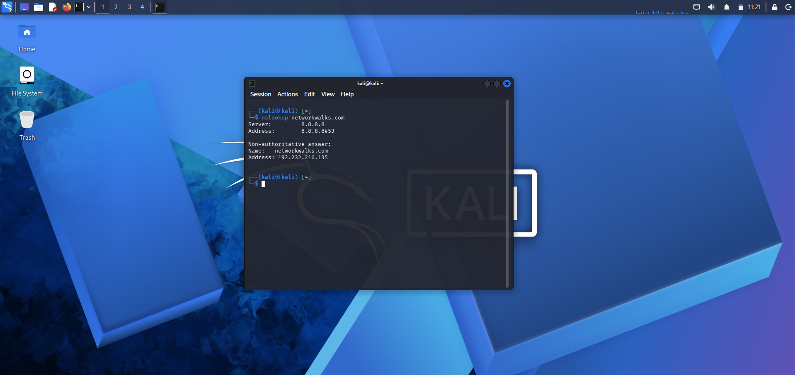
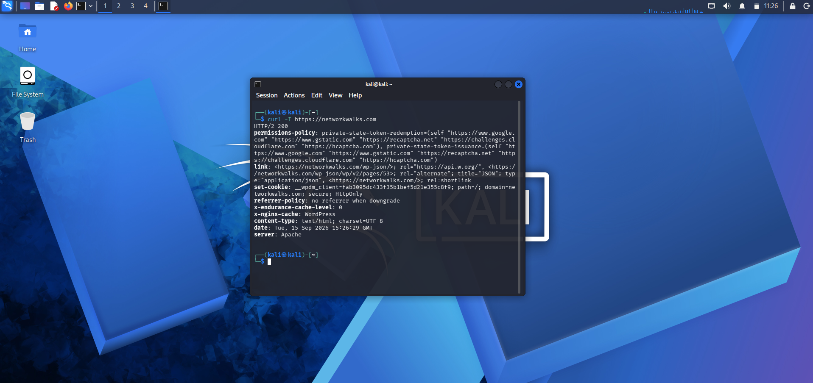
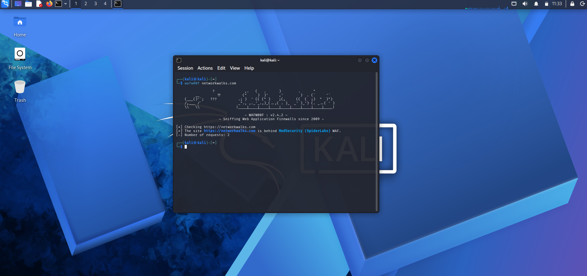
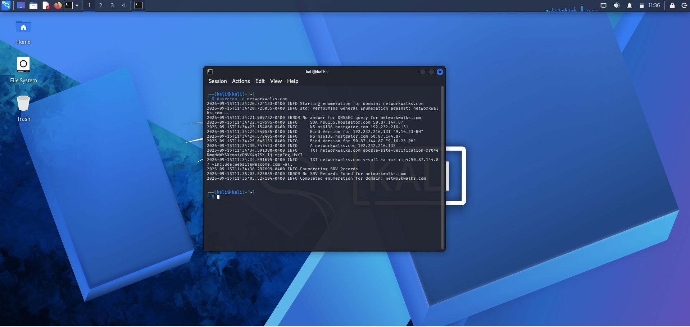
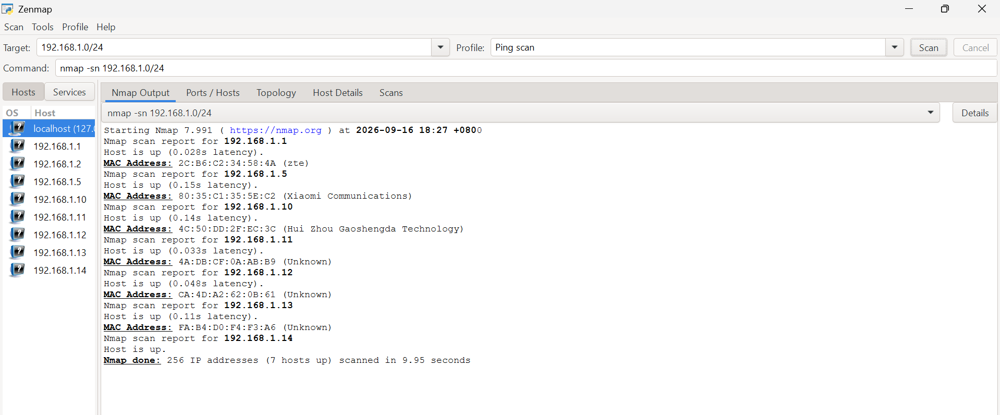
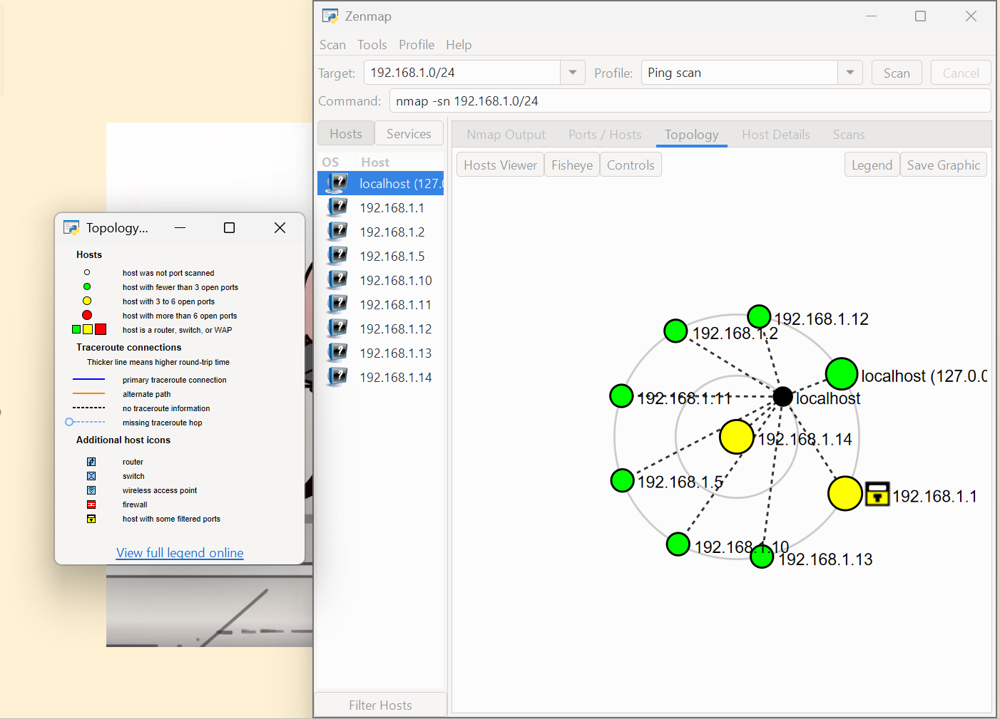

# PENETRATION TESTING REPORT 💻📑
### Footprinting & Network Scanning Phases

**W2-PM-FINAL  |  CYBERSECURITY  |  NETWORKWALKS**

| Field | Detail |
|---|---|
| **Pentester Name (Cybersecurity Professional)** | **Vivi Hanna Handison** |
| **Program/Batch** | B083-Networkwalks |
| **Date** | 18 September 2026 |
| **Modules completed** | W2-PM1 (Multiple Kali Tools) W2-PM4 (theHarvester) W2-PM5 (Zenmap Scanning) |
| **Client/Target** | 1. Networkwalks (secured written permission already) 2. Microsoft (public source only, passive OSINT only) 3. My own local LAN Network |
| **Permission secured from client?** | Yes |
| **Phases covered** | **Phase 1:** Reconnaissance & Footprinting **Phase 2:** Scanning & Network Discovery **Phase 3-5:** In Progress |

# 1. Liability Disclaimer ⚠️

I performed these activities only on systems & devices where I had secured written permission, or on devices/systems I own. All these materials are for educational and research purposes only. Do not use anything from here to break the law. The instructor, the authors, and Networkwalks are not responsible for what you do with this knowledge. Every action I take is my own responsibility. Misuse can lead to criminal charges, heavy fines, loss of my job, and a permanent record. In most countries, unauthorised access is a crime even when nothing is damaged.

# 2. Introduction 👋
This report covers footprinting the networkwalks.com domain using multiple Kali Linux tools (W2-PM1), theHarvester (W2-PM4), and scanning my own local network with Zenmap (W2-PM5). The first two modules cover the footprinting phase, and the other covers the scanning phase, so together they show how an attacker moves from gathering public information to mapping live hosts on a network. This is Week 2 part of my ongoing internship program at Networkwalks.
All commands were run in Kali Linux (footprinting) and on a Windows PC with Zenmap installed (scanning). Every step below includes the exact command used, the result I observed, and a screenshot as evidence

# 3. Tools Used 🔨

The table below lists each tool used in this report and its purpose.

| Tool | Purpose |
|---|---|
| Kali Linux & Windows | Operating systems used for reconnaissance activities             |
| WHOIS                | Find domain registration information (owner, dates, name servers).   |
| whatweb              | Identifies technology used by the website (server, CMS, plugins, IP).         |
| nslookup             | Resolve the domain name to its IP address using DNS.             |
| curl -I              | Read the HTTP response headers of the website and reveals the server type.                   |
| wafw00f              | Detect whether a Web Application Firewall protects the site.     |
| dnsrecon             | Enumerate all DNS records (NS, MX, SPF, TXT, SRV).               |
| theHarvester         | Gather information on emails, subdomains, hosts, employee names, open ports, and banners.   |
| Zenmap (Nmap GUI)    | Scan the local subnet to find live hosts, open ports, IPs, and MAC addresses. |
| Windows CMD          | Identify Local IP and MAC address.                        |

# 4. Activities Performed

## 4.1 Footprinting & Reconnaissance 🔍

I performed reconnaissance against the `networkwalks.com` domain using six Kali Linux tools: **WHOIS, WhatWeb, Nslookup, Curl, Wafw00f, and DNSRecon**. Each tool gathered a different type of information about the target.

1. **WHOIS** is used to obtain publicly available domain registration information and identify the domain’s name servers. The results provided information about the domain registration (ID, URL, Date, Contact, etc.) and hosting infrastructure.

2. **WhatWeb** was used to identify technologies used by the website. The results identified **WordPress 7.1** and **WP Download Manager 3.3.58**, along with other information exposed by the website.

3. **Nslookup** was used to resolve the domain name to its IP address. The provided result identified **192.232.216.135**.

4. **Curl** with the `-I` option was used to inspect the HTTP response headers. This provided additional information about the web application and exposed the WordPress REST API endpoint `/wp-json/`.

5. **Wafw00f** was used to determine whether a Web Application Firewall was protecting the website. The result identified **ModSecurity (SpiderLabs)**.

6. **DNSRecon** was used to enumerate DNS records. The results provided information on name servers, mail servers, SPF/TXT records, service records, and DNS software information.

## 4.3 theHarvester👣
I gathered public information from microsoft.com using theHarvester, run with both the Baidu source and all available sources.

`theHarvester -d microsoft.com -l 1000 -b baidu`
The Baidu source returns 0 IPs, emails, people, and hosts, which is expected because Baidu is a restricted search engine in China and because of rate limits. 

`theHarvester -d microsoft.com -l 50 -b all`
After scanning through all available sources, interesting results gathered from Hudson Rock Search return: 

- **602,369 total compromised items**

- **16,140 employees and 581,626 users flagged in breaches.**

- **43 hosts from employee URLs.**
 
Several sources (LeakIX, Windvane, THC, BuiltWith, SecurityScorecard, and others) returned missing API key warnings, which is expected since those sources require a paid or registered API key that isn't set up in this lab environment.

Note: 
*-d: Specifies the target domain (e.g., microsoft.com).*
*-l: Limits the number of search results to process (e.g., 50 or 1000).*
*-b: Specifies the data source or search engine to query (e.g., baidu or all).*

## 4.2 Network Scanning with Zenmap 🫆

For the second activity, I used **Zenmap** to perform network discovery on my local network. The practical required me to identify my local IP address and subnet, discover live hosts, identify their IP and MAC addresses, and generate a network topology.

I first used the Windows `ipconfig /all` command to identify my local IP address, LAN subnet, and MAC address. I then entered the subnet into Zenmap and selected **Ping Scan** to identify active hosts.

The results provided in the practical identified 7 live hosts:
`192.168.1.1`
`192.168.1.5`
`192.168.1.10`
`192.168.1.11`
`192.168.1.12`
`192.168.1.13`
`192.168.1.14`

And these are the corresponding MAC addresses for each IP above:
`2C:B6:C2:34:58:4A`
`80:35:C1:35:5E:C2`
`4C:50:DD:2F:EC:3C`
`4A:DB:CF:0A:AB:B9`
`CA:4D:A2:62:0B:61`
`FA:B4:D0:F4:F3:A6`
`B8:1E:A4:D3:FD:2F`

I then opened the **Topology** section in Zenmap, enabled the legend, and saved the network topology in PDF format as required by the practical task.

# 5. Evidences Collected 📸

*Screenshots collected as evidence during the activities (stored in the `evidence/` folder):*

-End-
